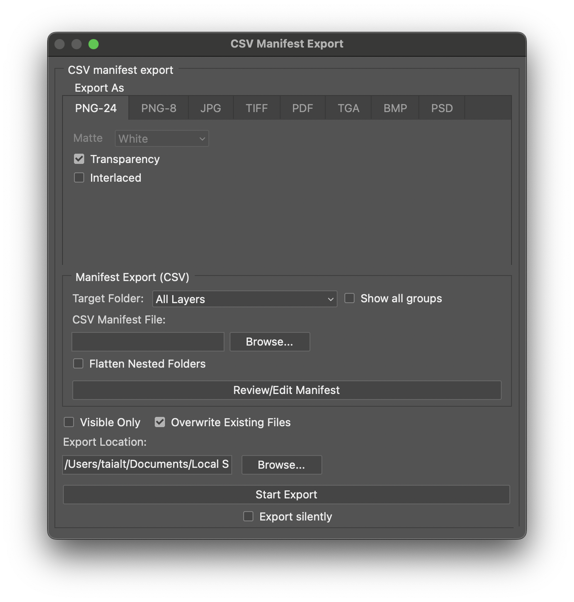

# Photoshop Export — CSV Manifest

A Photoshop script that exports layers to image files driven by a **CSV manifest** — width, height, padding, filename and fit mode are all defined per row, instead of being identical for every layer.

> Forked from [**antipalindrome / Photoshop-Export-Layers-to-Files-Fast**](https://github.com/antipalindrome/Photoshop-Export-Layers-to-Files-Fast). All the upstream features still work; this fork wraps a CSV-focused dialog around them.



## Install

1. Download `Export Layers To Files (Fast).jsx` and `Export Layers To Files (Fast)-progress_bar.json` (must sit in the **same folder**).
2. In Photoshop: **File → Scripts → Browse…** and pick the `.jsx`.
3. Optional: drop both files into Photoshop's `Presets/Scripts` folder so the script appears under `File → Scripts`.

## Use

1. Open your PSD/PSB.
2. Run the script. The dialog opens centered on the open document's folder for all browse buttons.
3. Pick a **Target Folder** (only top-level groups are listed by default — tick **Show all groups** to expand).
4. Pick a **CSV Manifest File** (see schema below).
5. Pick an **Export Location**.
6. Hit **Start Export**.

## CSV manifest schema

The manifest is a plain CSV. Optional `ignore_folders` line first, then a header row, then one row per output file.

```csv
ignore_folders,Draft,Hidden Assets,References/Unused
Width,Height,Padding,Filename,Mode
500,500,10,symbol_01,fit
600,400,5,banner_01,canvas
```

| Column     | Required | Description                                                       |
| ---------- | -------- | ----------------------------------------------------------------- |
| `Width`    | yes      | Output canvas width in pixels                                     |
| `Height`   | yes      | Output canvas height in pixels                                    |
| `Padding`  | yes      | Padding in pixels around the layer content                        |
| `Filename` | yes      | Output filename (no extension — extension comes from the format)  |
| `Mode`     | no       | `fit` (default) — scale to fit inside canvas minus padding · `canvas` — render the layer at canvas size |

`ignore_folders` (optional, first row) lists group paths to skip during export. See `Examples/` for full samples.

## Dev toggles

A small block near the top of the `.jsx` controls dialog visibility — flip and re-run, no other changes needed.

```js
var CSV_FOCUSED_UI = true;            // hide legacy panels, show only the CSV workflow
var DEBUG_CSV_MANIFEST = false;       // force-write the CSV debug log
var SHOW_VISIBLE_ONLY = true;         // show "Visible Only" checkbox in the action area
var SHOW_CSV_DEBUG_CHECKBOX = false;  // show the "Write CSV debug log" checkbox in the dialog
var TARGET_FOLDER_DEFAULT_NESTED = false; // false: top-level groups only · true: full nested tree
```

## Supported formats

PNG-24, PNG-8, JPG, TIFF, PDF, TGA, BMP, PSD.

## Requirements

Adobe Photoshop CS2 or later. Tested on macOS; should work on Windows since the upstream script does.

## Credits & License

- Original script: [antipalindrome / Photoshop-Export-Layers-to-Files-Fast](https://github.com/antipalindrome/Photoshop-Export-Layers-to-Files-Fast) — all upstream contributors.
- CSV manifest workflow + UI overhaul in this fork: [Taialt97](https://github.com/Taialt97).

MIT — see [LICENSE](LICENSE).
